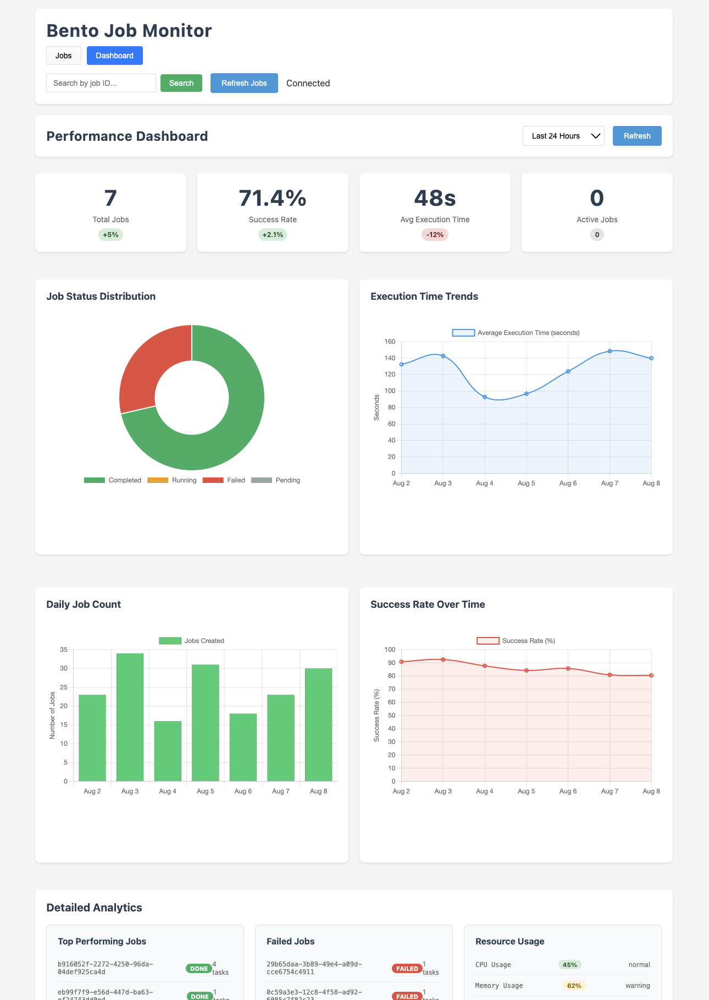

# Kumo - Task Management System

```
 _  __
| |/ /_   _ _ __ ___   ___
| ' /| | | | '_ ` _ \ / _ \
| . \| |_| | | | | | | |_| |
|_|\_\\__,_|_| |_| |_|\___/
```

A clean, modular Node.js/Express application for managing jobs and tasks with PostgreSQL backend.

> **Status**: Production-ready | **Version**: 1.0.0 | **Node.js**: >=18.0.0

## Project Structure

```
kumo/
├── config.js                 # Centralized configuration
├── server.js                 # Main application entry point
├── utils/                    # Utility classes
│   ├── QueryBuilder.js      # SQL query builder
│   └── Validator.js         # Input validation utilities
├── services/                 # Business logic
│   └── DatabaseService.js   # Database operations
├── middleware/               # Express middleware
│   ├── errorHandler.js      # Error handling middleware
│   ├── security.js          # Security middleware setup
│   └── validation.js        # Request validation middleware
├── routes/                   # API routes
│   └── api.js               # API endpoint definitions
├── public/                   # Static files
│   ├── index.html
│   ├── app.js
│   └── style.css
├── docs/                     # Documentation
│   └── screenshots/         # Application screenshots
└── test/                    # Tests
    └── example.test.js      # Example tests
```

## Quick Start

### Prerequisites
- Node.js >=18.0.0
- PostgreSQL >=12.0
- npm >=8.0.0

### Installation

1. **Clone and install dependencies:**
   ```bash
   git clone <repository-url>
   cd kumo
   npm install
   ```

2. **Configure environment variables:**
   ```bash
   # Database configuration
   export POSTGRES_HOST=localhost
   export POSTGRES_PORT=5432
   export POSTGRES_DB=taskdb
   export POSTGRES_USER=worker
   export POSTGRES_PASSWORD=password

   # Application configuration
   export NODE_ENV=development
   export PORT=3001
   ```

3. **Initialize database:**
   ```bash
   # Ensure PostgreSQL is running and database exists
   createdb taskdb
   ```

4. **Start the application:**
   ```bash
   npm start
   ```

5. **Verify installation:**
   ```bash
   curl http://localhost:3001/api/health
   # Expected: {"status":"healthy","database":"connected"}
   ```

**Access the application at:** `http://localhost:3001`

## Screenshots

### Dashboard Overview

*Main dashboard showing job statistics and real-time monitoring*

### Job Details with Timeline

*Detailed job view with Gantt chart timeline showing task progression*

### Task Management

*Task list view with progress tracking and error handling*

### Search and Filtering

*Advanced search functionality with real-time filtering*

## API Reference

### RESTful Endpoints

#### Job Management
| Method | Endpoint | Description | Response |
|--------|----------|-------------|----------|
| `GET` | `/api/jobs` | Retrieve all jobs with task statistics | `{jobs: [], pagination: {}, search: {}}` |
| `GET` | `/api/jobs/search` | Search jobs by criteria | `{jobs: [], pagination: {}, search: {}}` |
| `GET` | `/api/jobs/:jobId` | Get detailed job information | `{job: {}, tasks: [], taskCount: number}` |
| `GET` | `/api/jobs/:jobId/dependencies` | Get task dependencies | `{dependencies: [], count: number}` |
| `DELETE` | `/api/jobs/:jobId` | Delete job and all associated tasks | `{message: string, deletedJobId: string}` |
| `DELETE` | `/api/jobs/:jobId/tasks/:taskId` | Delete specific task | `{message: string, deletedTaskId: string}` |
| `DELETE` | `/api/jobs/completed` | Clear all completed jobs | `{message: string, deletedJobsCount: number, deletedJobIds: string[]}` |
| `DELETE` | `/api/jobs/failed` | Clear all failed jobs | `{message: string, deletedJobsCount: number, deletedJobIds: string[]}` |

#### System Operations
| Method | Endpoint | Description | Response |
|--------|----------|-------------|----------|
| `GET` | `/api/health` | System health check | `{status: string, database: string, uptime: number}` |
| `GET` | `/api/schema` | Database schema information | `{schema: {}, tables: []}` |
| `GET` | `/api/streams` | Retrieve data streams | `{streams: [], pagination: {}}` |

### Query Parameters

#### Pagination
- `limit` (number): Maximum number of results (default: 50, max: 100)
- `offset` (number): Number of results to skip (default: 0)

#### Search Filters
- `jobId` (string): Job identifier (supports partial matching with `partial=true`)
- `state` (string): Job state filter (`running`, `done`, `failed`, `pending`)
- `user_id` (string): Filter by user ID
- `partial` (boolean): Enable partial matching for jobId search

## Architecture Overview

### Module Structure

```
┌─────────────────┐    ┌─────────────────┐    ┌─────────────────┐
│   HTTP Layer    │    │  Business Logic │    │  Data Access    │
│                 │    │                 │    │                 │
│  routes/api.js  │───▶│ DatabaseService │───▶│   PostgreSQL    │
│  middleware/    │    │                 │    │                 │
└─────────────────┘    └─────────────────┘    └─────────────────┘
         │                       │                       │
         ▼                       ▼                       ▼
┌─────────────────┐    ┌─────────────────┐    ┌─────────────────┐
│   Validation    │    │   Utilities     │    │  Configuration  │
│                 │    │                 │    │                 │
│  Validator.js   │    │ QueryBuilder.js │    │   config.js     │
└─────────────────┘    └─────────────────┘    └─────────────────┘
```

### Core Components

#### Configuration Layer (`config.js`)
- Environment variable management with type coercion
- Database connection pool configuration
- Security middleware settings (rate limiting, CORS)
- Environment-specific configurations

#### Data Access Layer (`services/DatabaseService.js`)
- **Connection Management**: Pool-based PostgreSQL connections
- **Transaction Handling**: ACID-compliant operations with rollback support
- **Query Optimization**: Efficient SQL generation with parameterized queries
- **Error Recovery**: Graceful handling of connection failures and timeouts

#### Business Logic Layer (`utils/`)
- **QueryBuilder**: Fluent interface for dynamic SQL generation
  ```javascript
  const query = new QueryBuilder()
      .select(['id', 'state', 'COUNT(tasks)'])
      .from('jobs j')
      .join('tasks t', 'j.id = t.job_id')
      .where('j.state = ?', 'running')
      .groupBy(['j.id'])
      .build();
  ```
- **Validator**: Input sanitization and validation
  - Job ID validation (numeric/UUID)
  - Pagination bounds checking
  - Search parameter sanitization

#### HTTP Layer (`routes/`, `middleware/`)
- **Route Handlers**: RESTful endpoint implementations
- **Middleware Stack**: Security, validation, error handling
- **Dependency Injection**: Service layer integration
- **Response Standardization**: Consistent API responses

## Development Guidelines

### Code Standards

#### Language Features
- **ES2022+**: Utilize modern JavaScript features
- **Type Safety**: Use JSDoc for type annotations
- **Immutability**: Prefer const declarations and immutable patterns
- **Async/Await**: Use async/await over Promise chains

#### Naming Conventions
```javascript
// Classes: PascalCase
class DatabaseService { }

// Functions: camelCase
async function validateJobId() { }

// Constants: UPPER_SNAKE_CASE
const MAX_RETRY_ATTEMPTS = 3;

// Files: kebab-case
// database-service.js
```

#### Error Handling Strategy
```javascript
// HTTP Status Codes
400: ValidationError    // Invalid input parameters
401: Unauthorized       // Authentication required
403: Forbidden         // Insufficient permissions
404: NotFound          // Resource not found
409: Conflict          // Resource already exists
500: InternalError     // Server-side error
503: ServiceUnavailable // Database connection failed
```

### Security Implementation

#### Input Validation
- **SQL Injection Prevention**: Parameterized queries only
- **XSS Protection**: HTML entity encoding
- **Input Sanitization**: Whitelist validation approach
- **Rate Limiting**: Per-IP request throttling

#### Security Headers
```javascript
// Helmet configuration
contentSecurityPolicy: {
    defaultSrc: ["'self'"],
    styleSrc: ["'self'", "'unsafe-inline'"],
    scriptSrc: ["'self'"]
}
```

### Database Operations

#### Transaction Management
```javascript
const client = await pool.connect();
try {
    await client.query('BEGIN');
    // ... operations ...
    await client.query('COMMIT');
} catch (error) {
    await client.query('ROLLBACK');
    throw error;
} finally {
    client.release();
}
```

#### Connection Pooling
- **Max Connections**: 20 (configurable)
- **Idle Timeout**: 30 seconds
- **Connection Timeout**: 2 seconds
- **Health Checks**: Periodic connection validation

## Testing

### Test Architecture

```
test/
├── unit/           # Unit tests for individual modules
├── integration/    # Integration tests for API endpoints
├── fixtures/       # Test data and mock objects
└── utils/          # Test utilities and helpers
```

### Unit Testing Example

```javascript
const { expect } = require('chai');
const Validator = require('../utils/Validator');

describe('Validator', () => {
    describe('validateJobId', () => {
        it('should accept valid numeric job IDs', () => {
            const result = Validator.validateJobId('123');
            expect(result).to.equal('123');
        });

        it('should accept valid UUID job IDs', () => {
            const uuid = '550e8400-e29b-41d4-a716-446655440000';
            const result = Validator.validateJobId(uuid);
            expect(result).to.equal(uuid);
        });

        it('should reject invalid job IDs', () => {
            expect(() => Validator.validateJobId('invalid'))
                .to.throw('Job ID must be a valid number or UUID');
        });
    });
});
```

### Integration Testing

```javascript
const request = require('supertest');
const { app } = require('../server');

describe('API Endpoints', () => {
    it('should return jobs list', async () => {
        const response = await request(app)
            .get('/api/jobs')
            .expect(200);

        expect(response.body).to.have.property('jobs');
        expect(response.body).to.have.property('pagination');
    });
});
```

### Test Execution

```bash
# Run all tests
npm test

# Run tests with coverage
npm run test:coverage

# Run tests in watch mode
npm run test:watch
```

## Environment Variables

| Variable | Default | Description |
|----------|---------|-------------|
| `PORT` | 3001 | Server port |
| `NODE_ENV` | development | Environment mode |
| `POSTGRES_HOST` | 127.0.0.1 | Database host |
| `POSTGRES_PORT` | 5432 | Database port |
| `POSTGRES_DB` | taskdb | Database name |
| `POSTGRES_USER` | worker | Database user |
| `POSTGRES_PASSWORD` | password | Database password |
| `ALLOWED_ORIGINS` | * | CORS allowed origins |

## Contributing

### Development Workflow

1. **Fork and Clone**
   ```bash
   git clone https://github.com/your-username/kumo.git
   cd kumo
   npm install
   ```

2. **Create Feature Branch**
   ```bash
   git checkout -b feature/your-feature-name
   ```

3. **Development Standards**
   - Follow the established modular architecture
   - Implement comprehensive error handling
   - Add input validation for all new endpoints
   - Write unit tests for new functionality
   - Update documentation for API changes

4. **Code Review Checklist**
   - [ ] Modular structure maintained
   - [ ] Error handling implemented
   - [ ] Input validation added
   - [ ] Tests written and passing
   - [ ] Documentation updated
   - [ ] Security considerations addressed

5. **Submit Pull Request**
   - Provide clear description of changes
   - Include test coverage information
   - Reference any related issues

### Code Quality Standards

- **Linting**: ESLint configuration enforced
- **Formatting**: Consistent code style
- **Documentation**: JSDoc for public APIs
- **Testing**: Minimum 80% code coverage
- **Security**: Security audit passed
